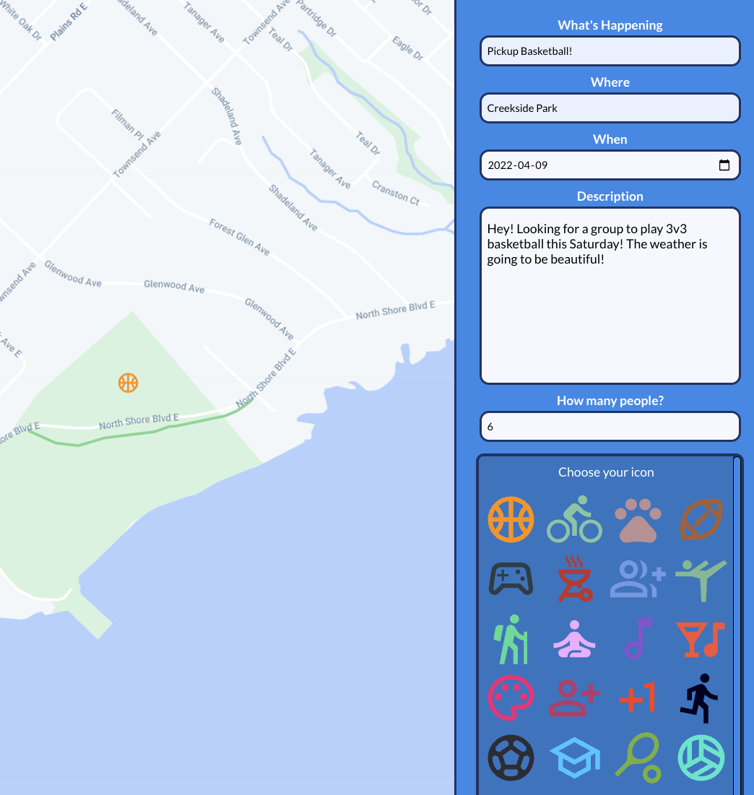
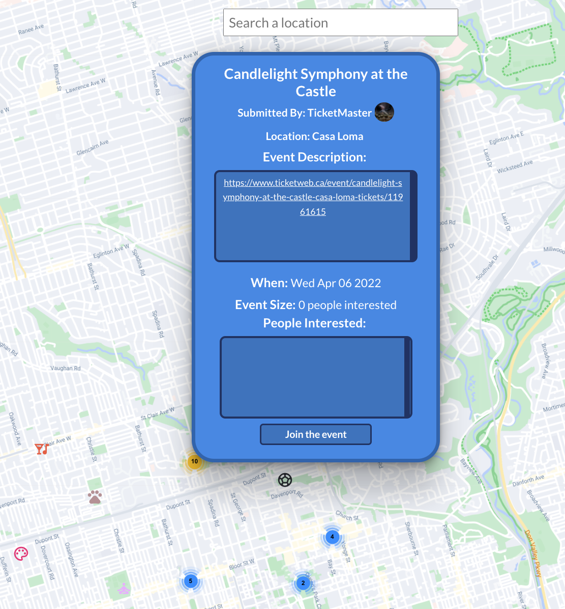
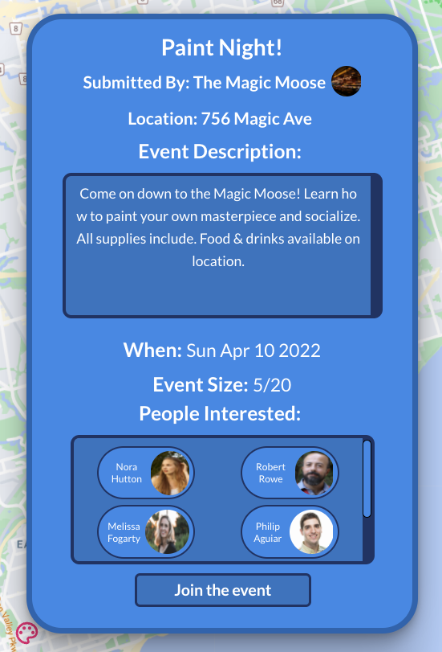
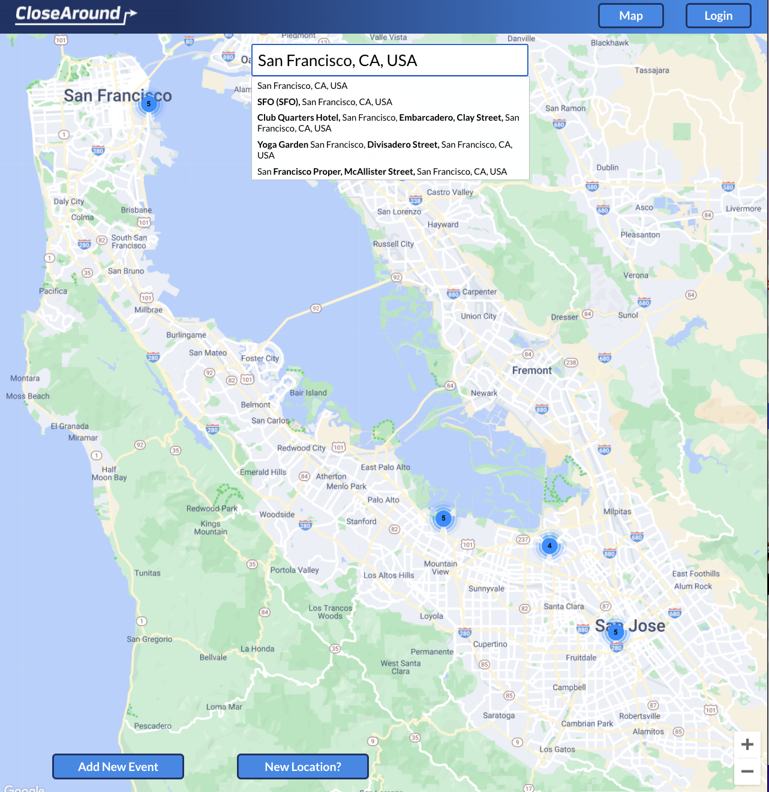

<!-- ABOUT THE PROJECT -->
## About The Project

Close around is a platform for people to see whats going around in their neighborhood from professional events to a local pickup game at the park. Just enter your location and the application does the rest!

(<a href="#top">back to top</a>)

### Built With

* [@reach/combobox](https://reach.tech/combobox/)
* [@react-google-maps/api](https://www.npmjs.com/package/@react-google-maps/api)
* [Axios](https://www.npmjs.com/package/axios)
* [Firebase](https://firebase.google.com/)
* [React](https://reactjs.org/)
* [use-places-autocomplete](https://www.npmjs.com/package/use-places-autocomplete)
* [Sass](https://sass-lang.com/)
* [PM2](https://pm2.keymetrics.io/)

(<a href="#top">back to top</a>)

<!-- GETTING STARTED -->
## Getting Started

To get started with this application make sure you have both the front end (https://github.com/PhilipAguiar/Close-Around) and back-end repositories (https://github.com/PhilipAguiar/Close-Around-api)

### Prerequisites

1) Install all dependencies using npm i on both front and back end repos.

2) Install additional package on api repository - npm install pm2

3) Npm start on front end and pm2 start app.js when ready ro run application

### Installation

1. Create a google maps api key at [https://console.cloud.google.com/projectselector2/google/maps-apis/credentials](https://console.cloud.google.com/projectselector2/google/maps-apis/credentials)

Instructors can use default in .env

<!-- USAGE EXAMPLES -->
## Usage

Create an account through and email or through facebook.

Approve the request for the application to use your location.

Easily see a map of your nearby area and find events you are interested in!

Once you see an event you like you can join the event and see who else is interested!

If you don't see an event your interested you can add your own!

Going on a trip or just curious whats happening somewhere else? You can search and find events worldwide.

<!-- CONTACT -->
## Contact

Philip Aguiar - [@GitHub](https://github.com/PhilipAguiar) - 
[@LinkedIn](https://www.linkedin.com/in/philip-aguiar/) -
PhilipAguiar@gmail.com

<!-- ACKNOWLEDGMENTS -->
## Acknowledgments

This Project would not be possible without the great eduction team at [BrainStation](https://brainstation.io/)

